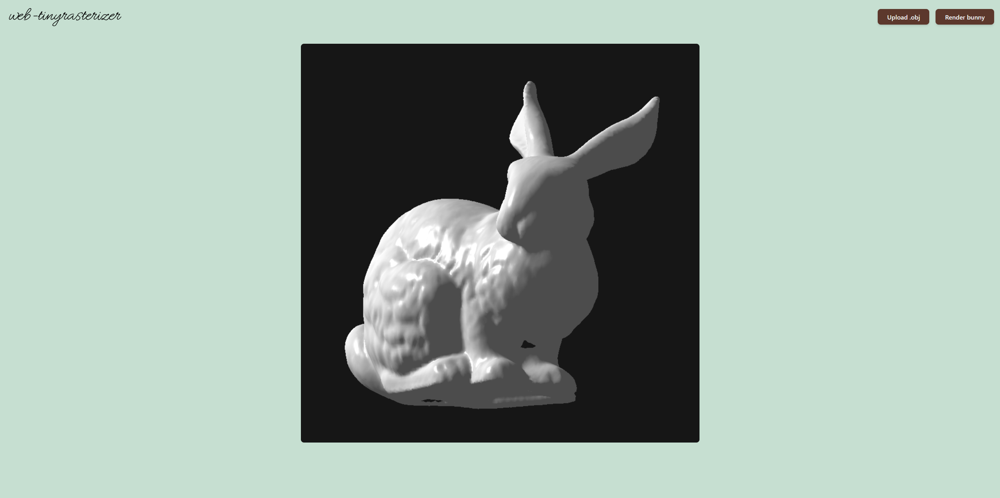

# Web Tiny Rasterizer

Port of tiny rasterizer written in TypeScript. Site uses Qwik framework.

This repo is part of a bigger project I decided not to finish. This is simply its guts, with a simple interface to go along with it.

Improvements to be considered:

- Let user change up the model matrix
### Stanford bunny example


## Usage

```shell
bun install
````

To start up the project:

```shell
bun run start
```